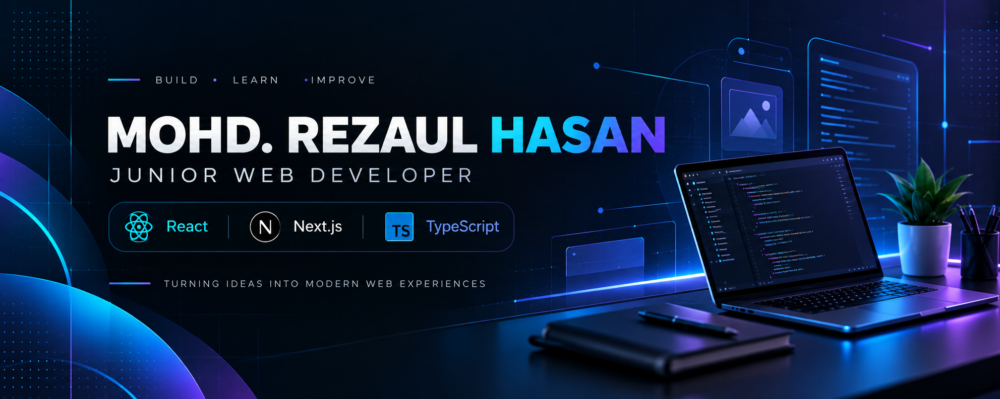

## Hi, I'm Mohd. Rezaul Hasan 👋

Welcome to my GitHub profile. I build and learn through hands-on web development projects, currently focusing on React, Next.js, and TypeScript.

## About Me

I'm an Electrical & Electronics Engineering graduate transitioning into software development, with a growing focus on modern web technologies. I enjoy turning ideas into clean, responsive web experiences while strengthening my understanding of JavaScript, React, Next.js, and TypeScript.

My engineering background shapes how I approach technical problems: systematically, with curiosity and a desire to understand how systems work.

## Current Focus

- Exploring Next.js and modern React development
- Building responsive web applications through hands-on projects
- Strengthening JavaScript and TypeScript fundamentals
- Learning cybersecurity and secure software development fundamentals

## Tech Stack

### Web Foundations

### Frameworks & Styling

### Tools & Workflow

## Featured Projects

### FitLog — Workout Library

A learning project for browsing workouts, building a daily workout plan, and saving exercises for later, with plans stored locally in the browser.

**Stack:** Next.js • React • TypeScript • Tailwind CSS

[Repository](https://github.com/rezaulhasan1369/assignment_6) · [Live Demo](https://assignment-6-two-pink.vercel.app/)

### Dev Stack Builder — Technology Stack Planner

A responsive React application for exploring development technologies and building a personalized tech stack, with duplicate prevention and easy stack management.

**Stack:** React • Vite • Tailwind CSS • DaisyUI • React-Toastify • JSON

[Repository](https://github.com/rezaulhasan1369/react-assignment-five) · [Live Demo](https://earnest-gingersnap-7bad9b.netlify.app/)

## Connect With Me

[LinkedIn](https://www.linkedin.com/in/mohd-rezaul-hasan/) · [GitHub](https://github.com/rezaulhasan1369) · [Email](mailto:rezaulhasan1369@gmail.com)
